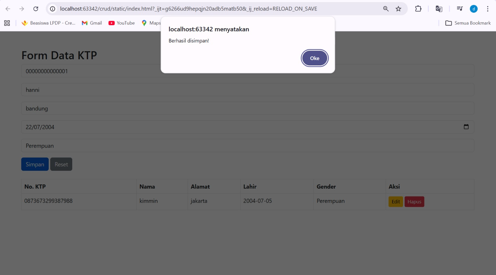
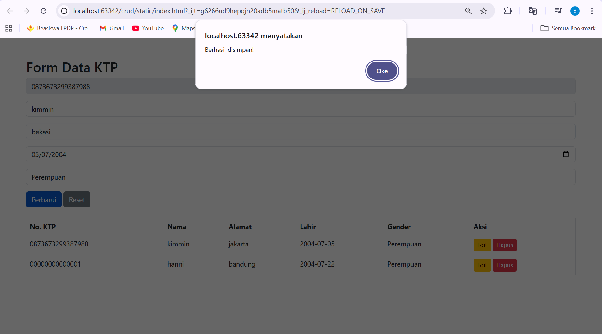
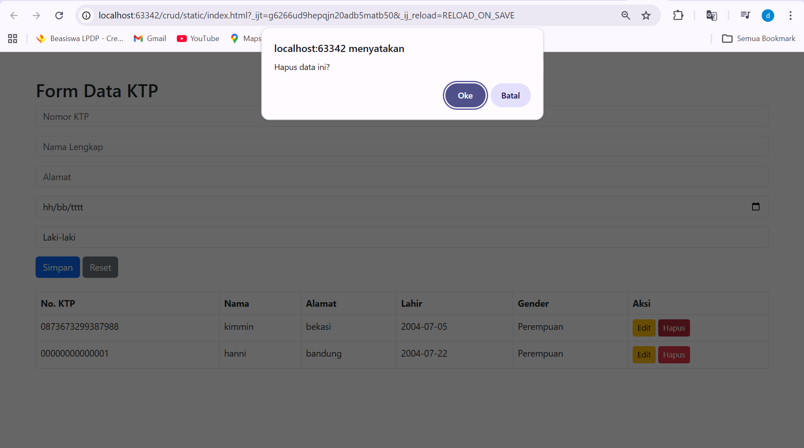

# Dokumentasi API - Manajemen KTP

## 1. Tambah Data (Create)
Digunakan untuk menambahkan data penduduk baru ke dalam database.

**Endpoint:** `POST /ktp`

**Request Body:**
```json
{
  "nomorKtp": "320101XXXXXXXXXX",
  "namaLengkap": "Dzakiyah Al Zahrani",
  "alamat": "Yogyakarta",
  "tanggalLahir": "2004-05-07",
  "jenisKelamin": "Perempuan"
}
````
## Update Data (Update)
   Digunakan untuk memperbarui data berdasarkan ID unik.

**Endpoint: PUT /ktp/{id}**

**Request Body:**
```json
{
  "nomorKtp": "320101XXXXXXXXXX",
  "namaLengkap": "Dzakiyah Al Zahrani",
  "alamat": "Yogyakarta",
  "tanggalLahir": "2004-05-07",
  "jenisKelamin": "Perempuan"
}
````

## 3. Delete Data (Delete)
Digunakan untuk menghapus data berdasarkan ID unik.

**Endpoint: DELETE /ktp/{id}**

## 4. Hasil Operasi (Response)
Success Response
Diberikan jika operasi berhasil dilakukan (Tambah/Update).
```json
{
  "nomorKtp": "320101XXXXXXXXXX",
  "namaLengkap": "Dzakiyah Al Zahrani",
  "alamat": "Yogyakarta",
  "tanggalLahir": "2004-05-07",
  "jenisKelamin": "Perempuan"
}
````

Success Delete Response
````json

  "Data berhasil dihapus"

````

Failed Response (Error Handling)
Diberikan jika terjadi kesalahan (misal: nomor KTP sudah ada atau data tidak ditemukan).

````json
{
  "status": 500,
  "error": "Internal Server Error",
  "message": "KTP sudah terdaftar"
}
````

## Tampilan ## 
Create 



Update



Delete


